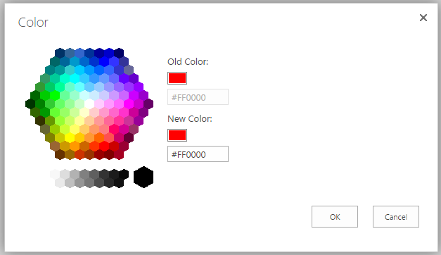

# SPColorPicker
Call color picker in SharePoint.

## Usage
```js
var options = {
    args: '#FF0000',
    dialogReturnValueCallback: function (dialogResult, returnValue) {
        if (dialogResult === 1) {
            alert(returnValue);
        }
    }
};

SPColorPicker.pick(options);
```



Here is the complete `options` object:

```js
var options = {
	title: title for the modal dialog,
	url: by default, it's "/_layouts/15/morecolors.aspx", which targets to SharePoint 2013,
	args: the "Old Color",
	dialogReturnValueCallback: the callback for the modal dialog, the value of dialogResult is 0 or 1. 1 means 'OK' is clicked, 0 means 'Cancel' is clicked
}
```


## License
MIT.
